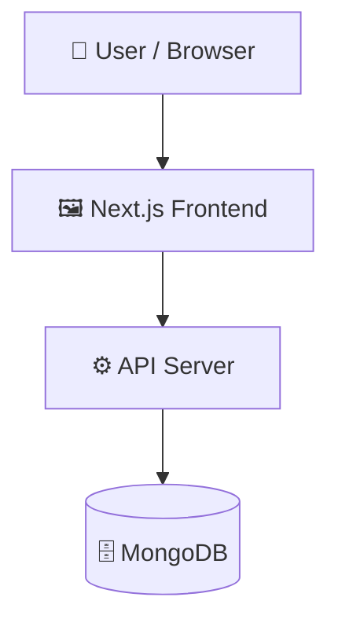

# project-matchmaker

       

## 📑 Table of Contents

- [Description](#description)
- [Tech Stack](#tech-stack)
- [Architecture](#architecture)
- [Quick Start](#quick-start)
- [Key Dependencies](#key-dependencies)
- [Available Scripts](#available-scripts)
- [API Endpoints](#api-endpoints)
- [Project Structure](#project-structure)
- [Development Setup](#development-setup)
- [Contributors](#contributors)
- [Contributing](#contributing)

## 📝 Description

project-matchmaker — a full-stack web app built with MongoDB, Next.js, Tailwind CSS, TypeScript.

## 🛠️ Tech Stack

- 🍃 **MongoDB**
- ▲ **Next.js**
- 🌬️ **Tailwind CSS**
- 📘 **TypeScript**

**Notable libraries:** Framer Motion, Mongoose, NextAuth, React Hook Form

## 🏗️ Architecture

A high-level view of how the main pieces fit together:



## ⚡ Quick Start

```bash

# 1. Clone the repository
git clone https://github.com/aryansinha1908/project-matchmaker.git

# 2. Install dependencies
npm install

# 3. Start the dev server
npm run dev
```

## 📦 Key Dependencies

```
@base-ui/react: ^1.6.0
@google/genai: ^2.10.0
@hello-pangea/dnd: ^18.0.1
@hookform/resolvers: ^5.4.0
@splinetool/react-spline: ^4.1.0
class-variance-authority: ^0.7.1
clsx: ^2.1.1
date-fns: ^4.4.0
framer-motion: ^12.41.0
lucide-react: ^1.21.0
mongoose: ^9.7.2
next: 16.2.9
next-auth: ^4.24.14
react: 19.2.4
react-dom: 19.2.4
```

## 🚀 Available Scripts

- **dev** — `npm run dev`
- **build** — `npm run build`
- **start** — `npm run start`
- **lint** — `npm run lint`

## 🌐 API Endpoints

Detected endpoints :

```
/api/auth/[...nextauth]
/api/chats/[chatId]/messages
/api/chats
/api/chats/teams
/api/dashboard
/api/hub/[projectId]
/api/invitations
/api/memberships/[membershipId]
/api/memberships
/api/my-projects
/api/projects/[projectId]/applications
/api/projects/[projectId]/apply
/api/projects/[projectId]/recommendations
/api/projects/[projectId]
/api/projects
/api/users/[userId]
/api/users/me
/api/users
```

## 📁 Project Structure

```
.
├── components.json
├── eslint.config.mjs
├── next.config.ts
├── package.json
├── postcss.config.mjs
├── src
│   ├── app
│   │   ├── api
│   │   │   ├── auth
│   │   │   │   └── [...nextauth]
│   │   │   │       └── ...
│   │   │   ├── chats
│   │   │   │   ├── [chatId]
│   │   │   │   │   └── ...
│   │   │   │   ├── route.ts
│   │   │   │   └── teams
│   │   │   │       └── ...
│   │   │   ├── dashboard
│   │   │   │   └── route.ts
│   │   │   ├── hub
│   │   │   │   └── [projectId]
│   │   │   │       └── ...
│   │   │   ├── invitations
│   │   │   │   └── route.ts
│   │   │   ├── memberships
│   │   │   │   ├── [membershipId]
│   │   │   │   │   └── ...
│   │   │   │   └── route.ts
│   │   │   ├── my-projects
│   │   │   │   └── route.ts
│   │   │   ├── projects
│   │   │   │   ├── [projectId]
│   │   │   │   │   └── ...
│   │   │   │   └── route.ts
│   │   │   └── users
│   │   │       ├── [userId]
│   │   │       │   └── ...
│   │   │       ├── me
│   │   │       │   └── ...
│   │   │       └── route.ts
│   │   ├── chats
│   │   │   └── page.tsx
│   │   ├── dashboard
│   │   │   ├── [username]
│   │   │   │   └── page.tsx
│   │   │   └── page.tsx
│   │   ├── favicon.ico
│   │   ├── globals.css
│   │   ├── hub
│   │   │   └── [projectId]
│   │   │       └── page.tsx
│   │   ├── layout.tsx
│   │   ├── login
│   │   │   └── page.tsx
│   │   ├── logout
│   │   │   └── page.tsx
│   │   ├── membership
│   │   │   └── new
│   │   │       └── page.tsx
│   │   ├── my-projects
│   │   │   └── page.tsx
│   │   ├── page.tsx
│   │   ├── profile
│   │   │   └── settings
│   │   │       └── page.tsx
│   │   ├── projects
│   │   │   ├── [projectId]
│   │   │   │   ├── applications
│   │   │   │   │   └── ...
│   │   │   │   ├── apply
│   │   │   │   │   └── ...
│   │   │   │   ├── page.tsx
│   │   │   │   └── settings
│   │   │   │       └── ...
│   │   │   ├── new
│   │   │   │   └── page.tsx
│   │   │   └── page.tsx
│   │   └── register
│   │       └── page.tsx
│   ├── components
│   │   ├── 3d-card-demo.tsx
│   │   ├── shared
│   │   │   ├── LoadingSpinner.tsx
│   │   │   ├── Navbar.tsx
│   │   │   └── PageContainer.tsx
│   │   └── ui
│   │       ├── 3d-card.tsx
│   │       ├── animated-shiny-text.tsx
│   │       ├── avatar.tsx
│   │       ├── badge.tsx
│   │       ├── button.tsx
│   │       ├── card.tsx
│   │       ├── dialog.tsx
│   │       ├── dropdown-menu.tsx
│   │       ├── input.tsx
│   │       ├── label.tsx
│   │       ├── select.tsx
│   │       ├── separator.tsx
│   │       └── textarea.tsx
│   ├── lib
│   │   ├── auth.ts
│   │   ├── db.ts
│   │   ├── gemini.ts
│   │   ├── github.ts
│   │   └── utils.ts
│   ├── models
│   │   ├── application.ts
│   │   ├── conversation.ts
│   │   ├── hub.ts
│   │   ├── invitation.ts
│   │   ├── membership.ts
│   │   ├── message.ts
│   │   ├── project.ts
│   │   └── user.ts
│   ├── providers
│   │   └── SessionProvider.tsx
│   ├── proxy.ts
│   └── types
│       ├── dashboardResponse.ts
│       └── next-auth.d.ts
└── tsconfig.json
```

## 🛠️ Development Setup

### Node.js / JavaScript

1. Install Node.js (v18+ recommended)
2. Install dependencies: `npm install` (or `yarn` / `pnpm install` / `bun install`)
3. Start the dev server: see the **Quick Start** above
